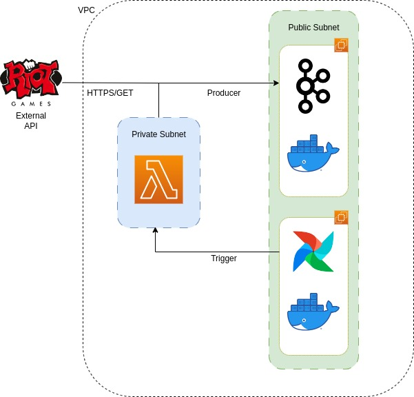

# League Streaming

The purpose of this personal project is to create a streaming pipeline for League of Legends matches.

As soon as a match of a certain player starts, this information is gathered from the official Riot Games API and sent to a Kafka topic.

This project is for studying purposes only.

# Architecture
All of the resources used in this project are hosted in an AWS Account, besides the Riot API (obviously).

  

                         

Both [Airflow](https://airflow.apache.org/docs/apache-airflow/stable/howto/docker-compose/index.html) and [Kafka](https://developer.confluent.io/quickstart/kafka-docker/?utm_medium=sem&utm_source=google&utm_campaign=ch.sem_br.nonbrand_tp.prs_tgt.dsa_mt.dsa_rgn.latam_lng.eng_dv.all_con.confluent-developer&utm_term=&creative=&device=c&placement=&gad=1&gclid=Cj0KCQjwyLGjBhDKARIsAFRNgW8bZex9Eq4Ujvt_SF17AwMNVQN5Gm49MjGFZvbxt63I5dCX2bXNPwYaAlaAEALw_wcB) were deployed in separate EC2 instances using Docker. I'm aware that AWS has some out of box solutions, but these services were deployed in EC2s to avoid excessive abstraction.

The Kafka instance has both the broker and zookeeper running in the same machine. This is absolutely not recommended in production environments, but will suffice for learning purposes.

The producer app is a LambdaFunction running a python code, which is triggered by an Airflow DAG.

# Network

All of the AWS resources are inside the same VPC. In this VPC, there are 2 subnets, with 2 route tables for each, which provides 2 network connections.

For establishing a functional connection, it will be necessary to configure the route tables as the following:

**Route Tables:**

Route table associated to the **public subnet**:

|Destination|Target |
|--|--|
|VPC CIDR   | local  |
|0.0.0.0/0  | IGW (your internet gateway)  |

Route table associated to the **private subnet**:

|Destination|Target |
|--|--|
|VPC CIDR   | local  |
|0.0.0.0/0  | NAT (your NAT gateway)  |

Keep in mind that using NAT has hourly charges ($).

**Security Groups:**

Associated to the **Kafka EC2**:

<ins>Inbound</ins>
|Port Range|Protocol| Source| Description
|--|--|--|--|
|9093 | TCP | Lambda security group| Allows lambda to communicate with Kafka
|22|TCP|0.0.0.0/0| SSH Permission

<ins>Outbound</ins>
|Port Range|Protocol| Destination| Description
|--|--|--|--|
|All | All |   0.0.0.0/0| -

Associated to the **Airflow EC2**:

I recommend  SSH tunneling for local usage, such as:

`ssh -i /path/my-key-pair.pem -L 8080:localhost:8080 ec2-user@my-instance-public-dns-name`

<ins>Inbound</ins>
|Port Range|Protocol| Source| Description
|--|--|--|--|
|22|TCP|0.0.0.0/0| SSH Permission

<ins>Outbound</ins>
|Port Range|Protocol| Destination| Description
|--|--|--|--|
|All | All |   0.0.0.0/0| -

Associated to the **Lambda Function**:

<ins>No inbound rules.</ins>

<ins>Outbound</ins>
|Port Range|Protocol| Destination| Description
|--|--|--|--|
|All | All |   0.0.0.0/0| -

**Next steps:**

This is a WIP project, so this is what will still be done:
- Adding lambda executions status monitoring to DAG
- Creation of the whole infrastructure using Terraform.
- Development of CI/CD using GitHub Actions.
